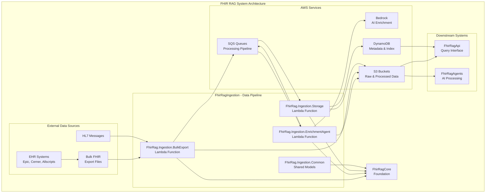
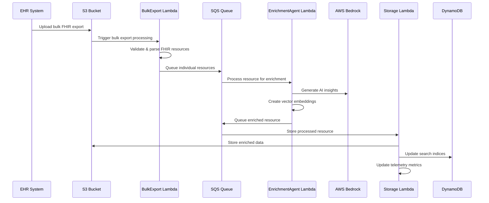

# FhirRag Ingestion Pipeline

## 🎯 Solution Overview

The **FhirRagIngestion** solution provides a comprehensive, serverless data ingestion pipeline for FHIR resources. This solution handles the complete workflow from bulk FHIR export processing through AI-powered enrichment to final storage and indexing, designed for high-throughput healthcare data processing with multi-tenant isolation.

## 🏗️ Architecture Role



## 📦 Projects

### FhirRag.Ingestion.BulkExport
**AWS Lambda function for processing bulk FHIR export files**

- **Purpose**: Initial processing of large FHIR export files from EHR systems
- **Runtime**: .NET 8.0 on AWS Lambda
- **Key Features**:
  - Handles compressed NDJSON files from bulk FHIR exports
  - Validates FHIR R4 resource compliance
  - Splits large files into manageable chunks
  - Tenant isolation and security validation
  - Error handling and retry logic

### FhirRag.Ingestion.EnrichmentAgent
**AWS Lambda function for AI-powered FHIR resource enrichment**

- **Purpose**: Enhance FHIR resources with AI-generated insights and clinical context
- **Runtime**: .NET 8.0 on AWS Lambda
- **Key Features**:
  - Bedrock LLM integration for clinical insights
  - Vector embedding generation for semantic search
  - Clinical terminology normalization
  - Risk assessment and clinical indicators
  - Quality scoring and completeness analysis

### FhirRag.Ingestion.Storage
**AWS Lambda function for final storage and indexing**

- **Purpose**: Persist enriched FHIR resources with optimized storage and indexing
- **Runtime**: .NET 8.0 on AWS Lambda
- **Key Features**:
  - Multi-tier storage (S3 + DynamoDB)
  - Search index optimization
  - Data archival and lifecycle management
  - Performance metrics collection
  - Backup and recovery coordination

### FhirRag.Ingestion.Common
**Shared models and utilities for ingestion pipeline**

- **Purpose**: Common data structures and utilities across ingestion components
- **Key Components**:
  - Pipeline message models
  - Processing state tracking
  - Error handling patterns
  - Configuration management
  - Validation helpers

## 🔄 Data Flow Pipeline



## 🔗 Key Interfaces and Models

### Processing Pipeline Models
```csharp
// Message structure for pipeline communication
public class IngestionMessage
{
    public string MessageId { get; set; }
    public string TenantId { get; set; }
    public string ResourceType { get; set; }
    public string ResourceId { get; set; }
    public ProcessingStage Stage { get; set; }
    public Dictionary<string, object> Metadata { get; set; }
}

// Processing result tracking
public class ProcessingResult
{
    public bool Success { get; set; }
    public string ProcessingId { get; set; }
    public TimeSpan ProcessingTime { get; set; }
    public List<ValidationError> Errors { get; set; }
    public Dictionary<string, object> Metrics { get; set; }
}

// Enrichment context
public class EnrichmentContext
{
    public string ResourceId { get; set; }
    public string ResourceType { get; set; }
    public Dictionary<string, object> ClinicalContext { get; set; }
    public List<string> Embeddings { get; set; }
    public double QualityScore { get; set; }
}
```

## 🔄 Dependencies

### Internal Dependencies
- **FhirRagCore**: Foundation libraries (security, telemetry, domain models)

### External Dependencies
- **AWS Lambda Runtime**: Serverless execution environment
- **AWS SDK**: S3, DynamoDB, SQS, Bedrock integration
- **HL7 FHIR .NET SDK**: FHIR R4 resource processing
- **Newtonsoft.Json**: JSON processing for NDJSON files
- **Polly**: Retry policies and resilience patterns

### AWS Services Integration
- **S3**: Raw and processed data storage
- **DynamoDB**: Metadata and search indices
- **SQS**: Asynchronous message processing
- **Lambda**: Serverless compute execution
- **Bedrock**: AI/ML model integration
- **CloudWatch**: Logging and monitoring

## 🚀 Deployment Instructions

### Prerequisites
- AWS CLI configured with appropriate permissions
- .NET 8.0 SDK
- AWS Lambda Tools: `dotnet tool install -g Amazon.Lambda.Tools`

### Build and Deploy
```bash
# Navigate to solution directory
cd solutions/FhirRagIngestion

# Restore dependencies
dotnet restore

# Build solution
dotnet build --configuration Release

# Deploy individual Lambda functions
cd FhirRag.Ingestion.BulkExport/src/FhirRag.Ingestion.BulkExport
dotnet lambda deploy-function --profile your-aws-profile

cd ../../FhirRag.Ingestion.EnrichmentAgent/src/FhirRag.Ingestion.EnrichmentAgent
dotnet lambda deploy-function --profile your-aws-profile

cd ../../FhirRag.Ingestion.Storage/src/FhirRag.Ingestion.Storage
dotnet lambda deploy-function --profile your-aws-profile
```

### Infrastructure as Code
Infrastructure is managed using AWS CDK in the [AppInfraCdkV1](https://github.com/Third-Opinion/AppInfraCdkV1) repository:

```bash
# Deploy ingestion infrastructure using CDK
git clone https://github.com/Third-Opinion/AppInfraCdkV1.git
cd AppInfraCdkV1
npm install
cdk deploy FhirRagIngestionStack --context environment=production --context tenantId=your-tenant-id
```

## ⚙️ Configuration

### Lambda Environment Variables
```bash
# Common configuration for all Lambda functions
FHIR_RAG_TENANT_ID=your-tenant-id
FHIR_RAG_ENVIRONMENT=production
AWS_REGION=us-east-1

# Storage configuration
FHIR_RAG_S3_BUCKET=fhir-rag-data-bucket
FHIR_RAG_DYNAMODB_TABLE=fhir-rag-resources
FHIR_RAG_SQS_QUEUE=fhir-rag-processing-queue

# AI/ML configuration
BEDROCK_MODEL_ID=anthropic.claude-v2
BEDROCK_REGION=us-east-1
EMBEDDING_MODEL_ID=amazon.titan-embed-text-v1

# Security
FHIR_RAG_ENCRYPTION_KEY=your-encryption-key
FHIR_RAG_JWT_SECRET=your-jwt-secret
```

### Pipeline Configuration (JSON)
```json
{
  "Pipeline": {
    "MaxConcurrentProcessing": 100,
    "RetryPolicy": {
      "MaxRetries": 3,
      "BackoffMultiplier": 2,
      "MaxBackoffSeconds": 300
    },
    "Timeouts": {
      "BulkExportTimeoutMinutes": 15,
      "EnrichmentTimeoutMinutes": 5,
      "StorageTimeoutMinutes": 3
    }
  },
  "Enrichment": {
    "EnableAiInsights": true,
    "EnableVectorEmbeddings": true,
    "QualityThreshold": 0.8,
    "ClinicalContextDepth": "detailed"
  },
  "Storage": {
    "EnableDataArchival": true,
    "ArchivalDays": 90,
    "CompressionEnabled": true,
    "IndexingStrategy": "optimized"
  }
}
```

## 🧪 Testing Strategy

### Unit Tests
Each Lambda function includes comprehensive unit tests:

```bash
# Run all ingestion tests
dotnet test --configuration Release

# Run specific component tests
dotnet test FhirRag.Ingestion.BulkExport.Tests --configuration Release
dotnet test FhirRag.Ingestion.EnrichmentAgent.Tests --configuration Release
dotnet test FhirRag.Ingestion.Storage.Tests --configuration Release
```

### Integration Tests
```bash
# Test with localstack for AWS services
docker run -d -p 4566:4566 localstack/localstack

# Run integration tests
dotnet test --configuration Release --filter Category=Integration
```

### Load Testing
```bash
# Test pipeline with sample FHIR data
aws s3 cp test-data/bulk-export-sample.ndjson s3://fhir-rag-test-bucket/

# Monitor processing through CloudWatch
aws logs tail /aws/lambda/FhirRag-Ingestion-BulkExport --follow
```

## 📊 Performance & Monitoring

### Performance Characteristics
- **Throughput**: 10,000+ FHIR resources per minute
- **Latency**: 
  - Bulk Export: < 15 minutes for 1GB files
  - Enrichment: < 5 seconds per resource
  - Storage: < 3 seconds per resource
- **Concurrency**: Up to 100 concurrent Lambda executions

### Monitoring & Alerting
```bash
# CloudWatch metrics to monitor
- Lambda execution duration
- SQS queue depth
- DynamoDB throttling
- S3 request rates
- Error rates by function

# Key alarms
- Processing queue backlog > 1000 messages
- Lambda error rate > 5%
- DynamoDB throttling events
- S3 4xx/5xx error rates
```

### Telemetry Integration
Each component automatically tracks:
- Processing step performance
- Resource throughput metrics
- Error patterns and rates
- Quality score distributions
- Cost optimization metrics

## 🔒 Security & Compliance

### Multi-Tenant Isolation
- All data includes tenant ID for strict isolation
- Lambda execution roles scoped to tenant resources
- Encrypted data at rest and in transit
- Audit trail for all processing activities

### HIPAA Compliance
- PHI data encryption with AWS KMS
- Access logging and monitoring
- Data retention policies
- Secure backup and recovery

### Error Handling
```csharp
// Robust error handling pattern
try
{
    var result = await ProcessFhirResourceAsync(resource, context);
    await LogSuccessAsync(result);
    return result;
}
catch (ValidationException ex)
{
    await LogValidationErrorAsync(ex, resource);
    await SendToDeadLetterQueueAsync(resource, ex);
    throw;
}
catch (Exception ex)
{
    await LogUnexpectedErrorAsync(ex, resource);
    await ScheduleRetryAsync(resource);
    throw;
}
```

## 🚨 Troubleshooting

### Common Issues

1. **Lambda Timeout Errors**
   ```bash
   # Check function timeout configuration
   aws lambda get-function-configuration --function-name FhirRag-Ingestion-BulkExport
   
   # Adjust timeout if needed
   aws lambda update-function-configuration \
     --function-name FhirRag-Ingestion-BulkExport \
     --timeout 900
   ```

2. **SQS Message Processing Delays**
   ```bash
   # Check queue attributes
   aws sqs get-queue-attributes \
     --queue-url https://sqs.us-east-1.amazonaws.com/123456789/fhir-rag-processing-queue \
     --attribute-names All
   ```

3. **DynamoDB Throttling**
   ```bash
   # Monitor table metrics
   aws cloudwatch get-metric-statistics \
     --namespace AWS/DynamoDB \
     --metric-name ConsumedReadCapacityUnits \
     --dimensions Name=TableName,Value=fhir-rag-resources
   ```

### Debugging Tools
```bash
# Stream Lambda logs
aws logs tail /aws/lambda/FhirRag-Ingestion-BulkExport --follow

# Check processing queue status
aws sqs get-queue-attributes \
  --queue-url $FHIR_RAG_SQS_QUEUE \
  --attribute-names ApproximateNumberOfMessages

# View DynamoDB processing metrics
aws dynamodb describe-table --table-name fhir-rag-resources
```

## 📈 Scaling & Optimization

### Auto-Scaling Configuration
- Lambda concurrency limits based on downstream capacity
- SQS visibility timeout optimization
- DynamoDB auto-scaling for read/write capacity
- S3 request rate optimization

### Cost Optimization
- S3 lifecycle policies for data archival
- Lambda memory optimization based on profiling
- DynamoDB on-demand vs provisioned capacity analysis
- CloudWatch log retention policies

## 🔧 Usage Examples

### Triggering Bulk Processing
```bash
# Upload FHIR export file to trigger processing
aws s3 cp patient-export.ndjson s3://fhir-rag-data-bucket/tenant-a/raw/2023/12/
```

### Monitoring Processing Status
```csharp
// Check processing status programmatically
var status = await ingestionService.GetProcessingStatusAsync(
    tenantId: "hospital-a",
    batchId: "batch-12345"
);

Console.WriteLine($"Status: {status.Stage}");
Console.WriteLine($"Progress: {status.ProcessedResources}/{status.TotalResources}");
Console.WriteLine($"Errors: {status.ErrorCount}");
```

### Manual Resource Processing
```csharp
// Process individual FHIR resource
var patient = new FhirPatient { /* patient data */ };
var message = new IngestionMessage
{
    ResourceType = "Patient",
    ResourceId = patient.Id,
    TenantId = "hospital-a",
    Stage = ProcessingStage.Enrichment
};

await sqsService.SendMessageAsync(queueUrl, message);
```

---

**🔄 Powering Healthcare Data Transformation - Scalable, Secure, Intelligent**